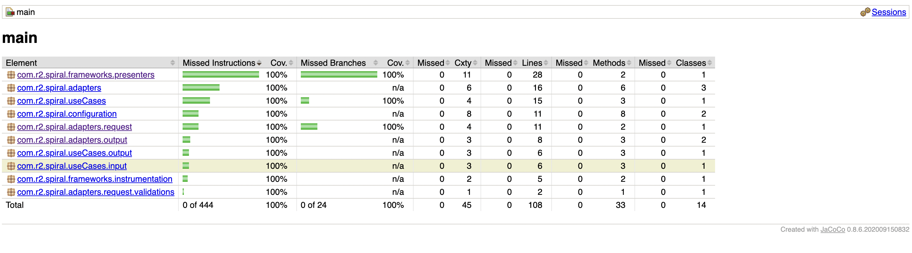
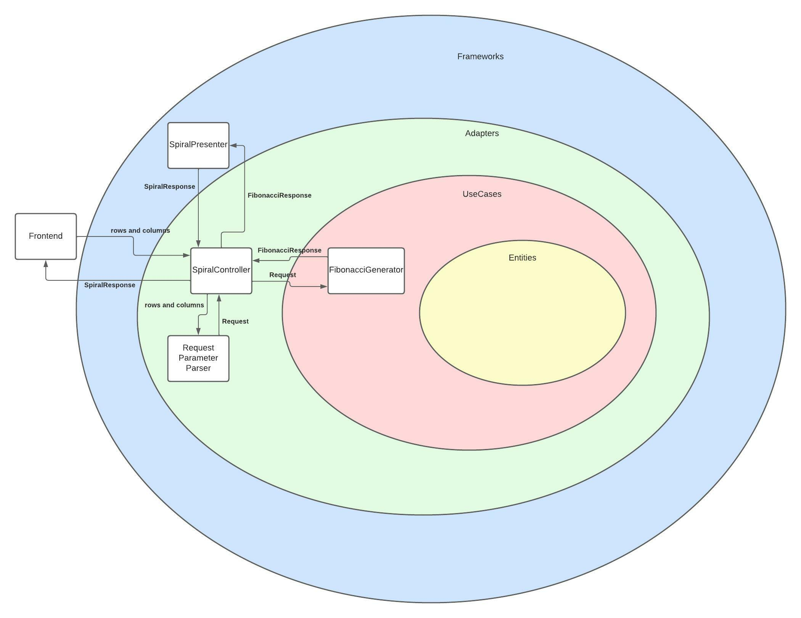

# Fibonacci Spiral Matrix

This is a Java Gradle application to generate a fibonacci sequence and present it in a spiral matrix.

## Test

The JaCoCo plugin provides code coverage metrics for Java code via integration with [JaCoCo](https://docs.gradle.org/current/userguide/jacoco_plugin.html)

This plugin was used in this project reaching 100% of coverage in the lines of code:

## Service Diagram

The architecture is based on the concept of clean architecture in wich we have Entities, useCases, adapters and frameworks

## Questions

* [rnoblega@gmail.com](rnoblega@gmail.com)
